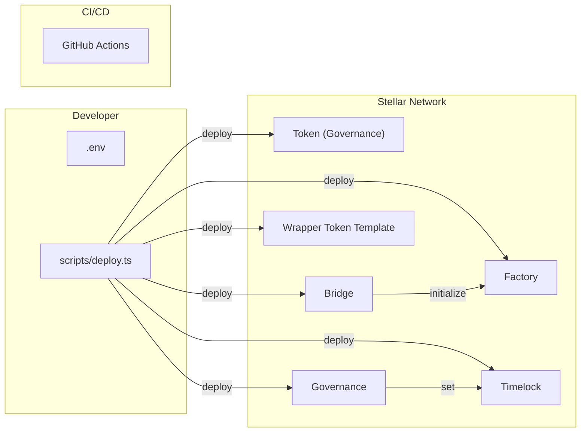

# Deployment Guide

## Prerequisites

1. **Stellar CLI** — Install from [Stellar developer tools](https://developers.stellar.org/docs/tools/developer-tools)
2. **Network credentials** — Stellar account with testnet/PUBNET tokens
3. **Environment configured** — Copy `.env.example` to `.env` and fill in values

## Deployment Architecture



## Step-by-Step Deployment

### 1. Network Selection

Set your target network in `.env`:

```bash
STELLAR_NETWORK=TESTNET
STELLAR_NETWORK_PASSPHRASE="Test SDF Network ; September 2015"
HORIZON_URL=https://horizon-testnet.stellar.org
SOROBAN_RPC_URL=https://soroban-testnet.stellar.org
```

For PUBNET:
```bash
STELLAR_NETWORK=PUBLIC
STELLAR_NETWORK_PASSPHRASE="Public Global Stellar Network ; September 2015"
HORIZON_URL=https://horizon.stellar.org
SOROBAN_RPC_URL=https://rpc.stellar.org
```

### 2. Fund the Deployer Account

Ensure the deployer account has sufficient XLM:
- Testnet: Use the [Stellar Lab Friendbot](https://laboratory.stellar.org/#account-creator?network=testnet)
- Pubnet: Purchase XLM from an exchange and fund the account

### 3. Build Contracts

```bash
pnpm contracts:build
```

This compiles all Soroban contracts to WASM:
- `contracts/target/wasm32-unknown-unknown/release/bridge.wasm`
- `contracts/target/wasm32-unknown-unknown/release/factory.wasm`
- `contracts/target/wasm32-unknown-unknown/release/wrapper_token.wasm`
- `contracts/target/wasm32-unknown-unknown/release/governance_token.wasm`
- `contracts/target/wasm32-unknown-unknown/release/governance.wasm`
- `contracts/target/wasm32-unknown-unknown/release/timelock.wasm`

### 4. Deploy Contracts

```bash
pnpm contracts:deploy
```

The script (`scripts/deploy.ts`):
1. Reads contract WASM files from the build output
2. Calls `stellar contract deploy` for each contract
3. Records returned contract IDs into `.env`

### 5. Initialize Contracts

After deployment, each contract must be initialized:

**Bridge**:
```bash
stellar contract invoke --id $BRIDGE_CONTRACT_ID -- initialize --admin $ADMIN --operators '["$OPERATOR1","$OPERATOR2"]' --threshold 2
```

**Factory**:
```bash
stellar contract invoke --id $FACTORY_CONTRACT_ID -- initialize --admin $ADMIN --template_hash $WRAPPER_TEMPLATE_HASH --bridge $BRIDGE_CONTRACT_ID
```

**Governance Token**:
```bash
stellar contract invoke --id $GOVERNANCE_TOKEN_ID -- initialize --admin $ADMIN --name "StellarDAO" --symbol "SDAO" --decimal 18
```

**Governance**:
```bash
stellar contract invoke --id $GOVERNANCE_CONTRACT_ID -- initialize --admin $ADMIN --token $GOVERNANCE_TOKEN_ID --timelock $TIMELOCK_CONTRACT_ID --voting_period 7000 --voting_delay 1 --proposal_threshold 1000000000000000000000 --quorum_numerator 4 --quorum_denominator 100
```

**Timelock**:
```bash
stellar contract invoke --id $TIMELOCK_CONTRACT_ID -- initialize --admin $ADMIN --governance $GOVERNANCE_CONTRACT_ID --min_delay 2880 --grace_period 720
```

### 6. Generate TypeScript Bindings

```bash
pnpm bindings:generate
```

This emits typed contract clients into `packages/soroban-client/src/bindings/`.

### 7. Start Services

```bash
# Development mode
docker compose up -d

# Or individual services:
pnpm --filter @stellardao/web dev      # Next.js on :3000
pnpm --filter @stellardao/api dev      # Fastify on :4000
pnpm --filter @stellardao/relayer dev  # Relayer watcher
```

## CI/CD Pipeline

### GitHub Actions

The repository includes two workflows:

| Workflow | Trigger | Actions |
|----------|---------|--------|
| `ci.yml` | Push/PR to main | Lint → Typecheck → Test → Build (WASM + Node) |
| `deploy.yml` | Manual dispatch | Build contracts → Deploy to TESTNET/PUBLIC |

### Required Secrets

For the deploy workflow, configure these GitHub secrets:

| Secret | Description |
|--------|-------------|
| `STELLAR_SECRET_KEY` | Deployer account secret key |
| `SSH_HOST` | Deployment server host |
| `SSH_KEY` | Deployment server SSH private key |
| `TURBO_TOKEN` | (Optional) Turborepo remote cache token |

## Docker Deployment

### Build Images

```bash
docker compose build
```

### Run Stack

```bash
docker compose up -d
```

This starts:
- **PostgreSQL 16** — Persistent storage on `:5432`
- **API** — Fastify REST + SSE on `:4000`
- **Web** — Next.js 15 dashboard on `:3000`
- **Relayer** — Cross-chain event watcher

### Production Deployment

For production, consider:

1. **Reverse proxy** — Nginx/Caddy in front of API and Web
2. **SSL/TLS** — Let's Encrypt for HTTPS
3. **Database** — Managed PostgreSQL (RDS, Cloud SQL, etc.)
4. **Monitoring** — Prometheus + Grafana or Datadog
5. **Logging** — Structured JSON logs → ELK/Loki
6. **Secrets management** — HashiCorp Vault or Doppler

## Post-Deployment Checklist

- [ ] All contracts deployed and verified on stellar.expert
- [ ] Bridge initialized with production operator set
- [ ] Factory initialized with correct template hash
- [ ] Timelock delay configured (min 24h for mainnet)
- [ ] Governance parameters verified
- [ ] API keys generated and distributed
- [ ] HMAC webhook secret configured
- [ ] Rate limits tuned for expected traffic
- [ ] Monitoring alerts configured
- [ ] Incident response runbook documented
