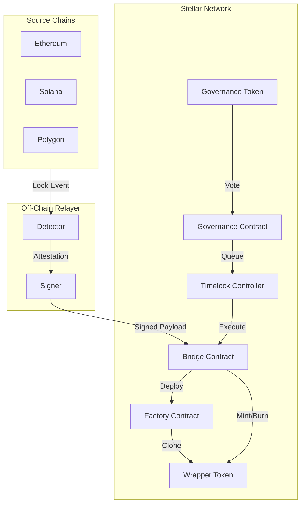
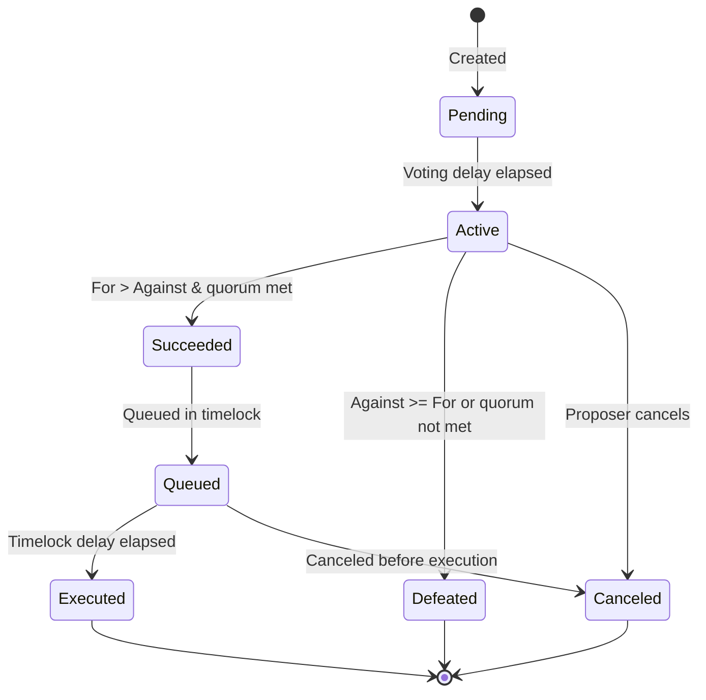

# StellarDAO Smart Contracts

## Overview

StellarDAO consists of six Soroban smart contracts written in Rust, all pinned to `soroban-sdk = "=21.7.7"`. Each contract is compiled to WebAssembly (WASM) and deployed to the Stellar network via `stellar contract deploy`.

## Contract Architecture



## Contract Inventory

| Contract | Directory | Description |
|----------|-----------|-------------|
| Bridge | `contracts/bridge/` | Cross-chain message verification, mint/burn orchestration |
| Factory | `contracts/factory/` | Deterministic wrapper-token deployment and registry |
| Wrapper Token | `contracts/wrapper-token/` | SEP-41 token template (SAC-level) |
| Governance Token | `contracts/governance-token/` | SEP-41 token with delegation and checkpointing |
| Governance | `contracts/governance/` | Proposal creation, voting, queueing, execution |
| Timelock | `contracts/timelock/` | Delayed execution controller for governance safety |

---

## Bridge Contract

**File**: `contracts/bridge/src/lib.rs`

The bridge is the core entry point for cross-chain operations. It verifies signed attestations from relayer operators and orchestrates minting/burning of wrapper tokens.

### Initialization

```rust
pub fn initialize(env: Env, admin: Address, operators: Vec<BytesN<32>>, threshold: u32)
```

One-shot initialization that sets:
- **admin**: Single admin address with privileged access
- **operators**: N-of-M verifier set (ed25519 public keys)
- **threshold**: Minimum signatures required for attestation acceptance
- **fee_bps**: Protocol fee in basis points (default: 0)
- **paused**: Bridge starts in active state (default: false)

### Key Functions

| Function | Auth | Description |
|----------|------|-------------|
| `mint_with_attestation` | relayer | Mint wrapper tokens after verifying Lock attestations |
| `burn_with_attestation` | relayer | Burn wrapper tokens after verifying Unlock attestations |
| `pause` / `unpause` | admin | Emergency pause mechanism |
| `set_fee` / `set_fee_collector` | admin | Protocol fee management |
| `set_verifiers` | admin | Update the N-of-M verifier set |
| `initiate_emergency_recovery` | admin | Start emergency recovery with timelock |
| `execute_emergency_withdrawal` | admin | Execute emergency fund withdrawal after timelock |

### Security Model

1. **Signature Threshold**: N-of-M operator signatures required for any mint/burn
2. **Nonce Replay Protection**: Each consumed nonce is stored in `persistent` storage
3. **Pause Mechanism**: Admin can halt all bridge operations immediately
4. **Emergency Recovery**: Timelocked admin takeover with configurable delay
5. **Cross-Contract Auth**: Uses `env.authorize_as_current_contract` for wrapper-token sub-invocations

### Events

| Event | Topics | Payload |
|-------|--------|---------|
| `MintRequested` | `(bridge, MintRequested)` | `(wrapper_token, recipient, amount, source_chain, source_token, nonce)` |
| `BurnRequested` | `(bridge, BurnRequested)` | `(wrapper_token, source_address, amount, nonce)` |
| `Paused` | `(bridge, Paused)` | `()` |
| `Unpaused` | `(bridge, Unpaused)` | `()` |
| `EmergencyRecoveryInitiated` | `(bridge, EmergencyRecoveryInitiated)` | `(eta)` |
| `EmergencyRecoveryCanceled` | `(bridge, EmergencyRecoveryCanceled)` | `()` |
| `EmergencyWithdrawalExecuted` | `(bridge, EmergencyWithdrawalExecuted)` | `(admin)` |

---

## Factory Contract

**File**: `contracts/factory/src/lib.rs`

The factory contract manages deterministic deployment of wrapper tokens. It stores a template WASM hash and deploys new wrapper contracts for each `(source_chain, source_token)` pair.

### Key Functions

| Function | Auth | Description |
|----------|------|-------------|
| `initialize` | admin | One-shot init with template WASM hash and bridge address |
| `create_wrapper` | bridge | Deploy a new wrapper token (deterministic address) |
| `get_wrapper` | anyone | Look up deployed wrapper by source chain + token |
| `set_template` | admin | Update the wrapper token template |

### Deterministic Addresses

The factory produces the same contract ID for the same `(source_chain, source_token)` pair every time, preventing front-running and pre-computation attacks.

---

## Wrapper Token Contract

**File**: `contracts/wrapper-token/src/lib.rs`

SEP-41 compliant token contract with mint/burn controlled exclusively by the bridge. Each wrapper token represents a specific source-chain asset.

### Key Functions

| Function | Auth | Description |
|----------|------|-------------|
| `initialize` | admin | One-shot init with metadata, bridge address |
| `mint` | bridge only | Mint tokens to a recipient |
| `burn` | bridge only | Burn tokens from an address |
| `transfer` | anyone | Standard SEP-41 transfer |
| `approve` / `allowance` | anyone | Standard SEP-41 approval |
| `name` / `symbol` / `decimals` | anyone | SEP-41 metadata queries |

### Security

- `mint`/`burn` are restricted to the bridge contract address
- `initialize` is one-shot — the bridge address is permanently pinned

---

## Governance Token Contract

**File**: `contracts/governance-token/src/lib.rs`

SEP-41 token extended with voting delegation and checkpointing (similar to Compound's COMP token).

### Key Functions

| Function | Auth | Description |
|----------|------|-------------|
| `delegate` | token holder | Delegate voting power to another address |
| `get_current_votes` | anyone | Query voting power at current ledger |
| `get_past_votes` | anyone | Query checkpointed voting power at a historical ledger |
| `mint` | admin | Mint new governance tokens |
| `burn` | admin | Burn governance tokens |

### Checkpointing

Voting power is snapshotted at each delegation change. The governance contract reads these checkpoints to determine voting power at proposal creation time.

---

## Governance Contract

**File**: `contracts/governance/src/lib.rs`

On-chain DAO governance: create proposals, vote, queue via timelock, and execute.

### Proposal Lifecycle



### Key Parameters

| Parameter | Description | Default |
|-----------|-------------|---------|
| Voting Period | Duration in ledgers | 7 days (~7,000 ledgers) |
| Voting Delay | Delay before voting starts | 1 ledger |
| Proposal Threshold | Min voting power to propose | 1,000 tokens |
| Quorum | % of total supply required | 4% |

---

## Timelock Controller

**File**: `contracts/timelock/src/lib.rs`

Delays governance execution by a configurable number of ledgers, providing a window for users to review and exit if necessary.

### Key Functions

| Function | Auth | Description |
|----------|------|-------------|
| `initialize` | admin | One-shot init with governance address and delay |
| `queue_transaction` | governance | Queue a transaction for delayed execution |
| `execute_transaction` | governance | Execute after delay expires |
| `cancel_transaction` | admin/governance | Cancel before execution |
| `set_min_delay` | admin | Update the minimum delay |

### Timing

- **Min Delay**: Minimum ledgers before execution (configurable)
- **Grace Period**: Window after ETA during which execution is allowed
- **ETA Calculation**: `current_ledger + min_delay`

---

## Storage Architecture

```rust
enum DataKey {
    Initialized,         // bool: one-shot guard
    Admin,               // Address: contract admin
    Operators,           // Vec<BytesN<32>>: verifier set
    Threshold,           // u32: signature threshold
    Paused,              // bool: emergency pause
    FeeBps,              // u32: protocol fee basis points
    FeeCollector,        // Address: fee recipient
    EmergencyAdmin,      // Address: emergency fallback admin
    EmergencyTimelock,   // u32: recovery timelock ETA
}
```

- **Instance Storage**: Configuration values (admin, operators, threshold)
- **Persistent Storage**: Nonces, proposals, timelock transactions
- **Temporary Storage**: Not used (all state must survive upgrades)

---

## Gas Optimization Notes

1. **Pinned SDK version** (`=21.7.7`) — deterministic WASM output per commit
2. **`#[contracterror]`** — custom errors are cheaper than string panics
3. **Persistent vs Instance** — persistent storage for long-lived user data
4. **Minimal storage reads** — cache values where possible
5. **Batch operations** — `Vec` arguments for multi-action proposals

---

## Known Limitations

1. **Testutils unavailable** — `soroban-sdk` testutils feature is disabled due to trait resolution issues (see `docs/soroban-testutils-issue.md`)
2. **Signature verification stubbed** — real ed25519 verification uses `env.crypto()` but the attestation digest format may need auditing before mainnet
3. **No upgradability pattern** — contracts are immutable after deployment; future upgrades require new deployments and migration
