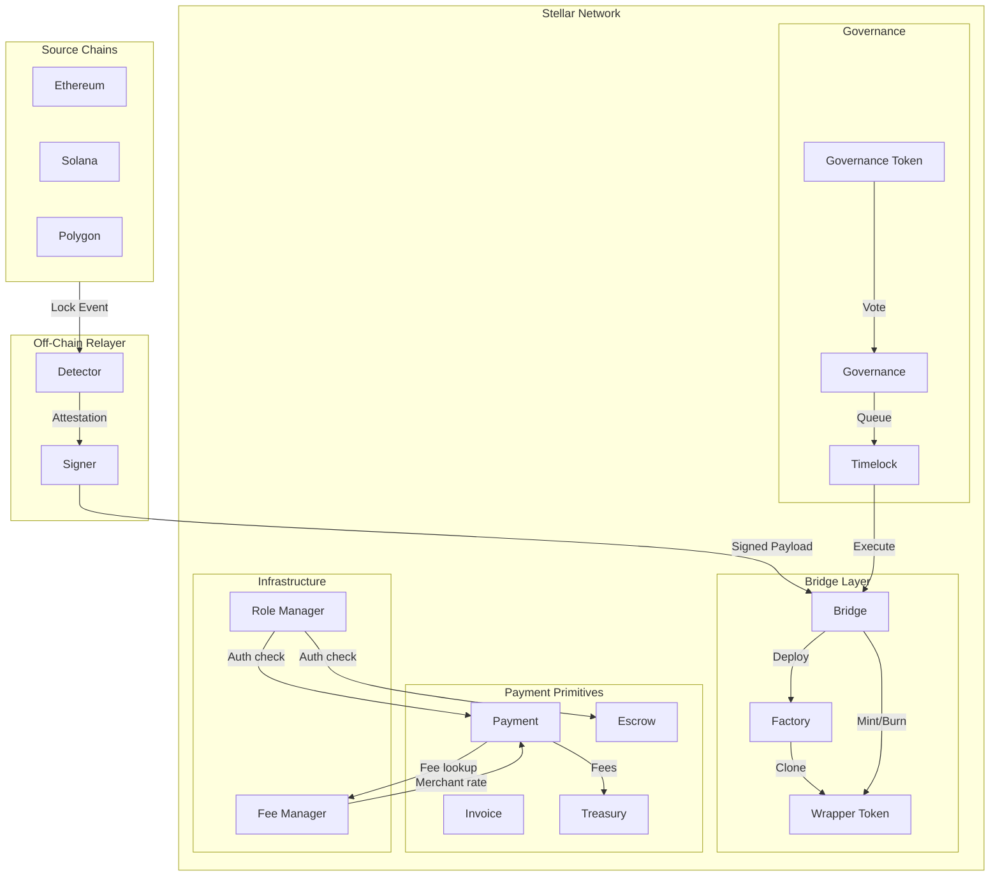

# Stellar Payment Gateway Smart Contracts

## Overview

Stellar Payment Gateway consists of **twelve** Soroban smart contracts written in Rust,
all pinned to `soroban-sdk = "=21.7.7"`. Each contract is compiled to WebAssembly (WASM)
and deployed to the Stellar network via `stellar contract deploy`.

Contracts are organized into four layers:

| Layer | Contracts | Purpose |
|-------|-----------|---------|
| Bridge | `bridge`, `factory`, `wrapper-token` | Cross-chain asset wrapping |
| Payments | `payment`, `escrow`, `invoice`, `treasury` | On-chain payment primitives |
| Governance | `governance-token`, `governance`, `timelock` | DAO operations |
| Infrastructure | `fee-manager`, `role-manager` | Platform-wide configuration + RBAC |

## Contract Architecture


```mermaid
flowchart TD
    subgraph Source_Chains["Source Chains"]
        ETH[Ethereum]
        SOL[Solana]
        POL[Polygon]
    end

    subgraph Relayer["Off-Chain Relayer"]
        D[Detector]
        S[Signer]
    end

    subgraph Stellar["Stellar Network"]
        subgraph BridgeLayer["Bridge Layer"]
            B[Bridge]
            F[Factory]
            WT[Wrapper Token]
        end
        subgraph Payments["Payment Primitives"]
            P[Payment]
            E[Escrow]
            I[Invoice]
            T[Treasury]
        end
        subgraph Governance["Governance"]
            GT[Governance Token]
            G[Governance]
            TL[Timelock]
        end
        subgraph Infra["Infrastructure"]
            FM[Fee Manager]
            RM[Role Manager]
        end
    end

    Source_Chains -->|Lock Event| D
    D -->|Attestation| S
    S -->|Signed Payload| B
    B -->|Deploy| F
    F -->|Clone| WT
    B -->|Mint/Burn| WT
    P -->|Fees| T
    P -->|Fee lookup| FM
    FM -->|Merchant rate| P
    RM -->|Auth check| P
    RM -->|Auth check| E
    G -->|Queue| TL
    TL -->|Execute| B
    GT -->|Vote| G
```

## Contract Inventory

| # | Contract | Directory | Layer |
|---|----------|-----------|-------|
| 1 | Bridge | `contracts/bridge/` | Bridge |
| 2 | Factory | `contracts/factory/` | Bridge |
| 3 | Wrapper Token | `contracts/wrapper-token/` | Bridge |
| 4 | Payment | `contracts/payment/` | Payments |
| 5 | Escrow | `contracts/escrow/` | Payments |
| 6 | Invoice | `contracts/invoice/` | Payments |
| 7 | Treasury | `contracts/treasury/` | Payments |
| 8 | Governance Token | `contracts/governance-token/` | Governance |
| 9 | Governance | `contracts/governance/` | Governance |
| 10 | Timelock | `contracts/timelock/` | Governance |
| 11 | Fee Manager | `contracts/fee-manager/` | Infrastructure |
| 12 | Role Manager | `contracts/role-manager/` | Infrastructure |

---

## Bridge Layer

### Bridge Contract

**File**: `contracts/bridge/src/lib.rs`

The core entry point for cross-chain operations. Verifies signed attestations
from relayer operators and orchestrates minting/burning of wrapper tokens.

| Function | Auth | Description |
|----------|------|-------------|
| `mint_with_attestation` | relayer | Mint wrapper tokens after verifying Lock attestations |
| `burn_with_attestation` | relayer | Burn wrapper tokens after verifying Unlock attestations |
| `pause` / `unpause` | admin | Emergency pause mechanism |
| `set_fee` / `set_fee_collector` | admin | Protocol fee management |
| `set_verifiers` | admin | Update N-of-M verifier set |
| `initiate_emergency_recovery` | admin | Timelocked emergency recovery |

**Events**: `MintRequested`, `BurnRequested`, `Paused`, `Unpaused`, `EmergencyRecoveryInitiated`

### Factory Contract

**File**: `contracts/factory/src/lib.rs`

Deterministic wrapper-token deployment. Produces the same contract ID for
the same `(source_chain, source_token)` pair every time.

| Function | Auth | Description |
|----------|------|-------------|
| `create_wrapper` | bridge | Deploy wrapper token (deterministic address) |
| `get_wrapper` | anyone | Look up deployed wrapper by source chain + token |

### Wrapper Token Contract

**File**: `contracts/wrapper-token/src/lib.rs`

SEP-41 compliant token with mint/burn restricted to the bridge.

| Function | Auth | Description |
|----------|------|-------------|
| `mint` / `burn` | bridge only | Supply control |
| `transfer` / `approve` / `transfer_from` | anyone | Standard SEP-41 |

---

## Payment Primitives

### Payment Contract

**File**: `contracts/payment/src/lib.rs`

Handles XLM and Stellar asset transfers with configurable platform fees.

| Function | Auth | Description |
|----------|------|-------------|
| `send_xlm` | sender | Transfer XLM with fee deduction |
| `send_asset` | sender | Transfer custom Stellar asset |
| `batch_payment` | sender | Up to 50 atomic payments |
| `set_fee` / `set_fee_collector` | admin | Fee configuration (max 5%) |
| `pause` / `unpause` | admin | Emergency halt |
| `balance_of` | anyone | Query tracked balance |

**Events**: `PaymentSent`, `BatchPaymentExecuted`, `FeeUpdated`, `Paused`, `Unpaused`

### Escrow Contract

**File**: `contracts/escrow/src/lib.rs`

Time-locked escrow with 6-state lifecycle and arbiter dispute resolution.

| Function | Auth | Description |
|----------|------|-------------|
| `create_escrow` | depositor | Create escrow with recipient + arbiter |
| `fund_escrow` | depositor | Lock funds in escrow |
| `release_escrow` | depositor or arbiter | Release to recipient |
| `refund_escrow` | recipient or arbiter | Refund to depositor |
| `dispute_escrow` | either party | Raise dispute |
| `resolve_dispute` | arbiter only | Split funds (must sum to amount) |
| `get_escrow` / `escrow_count` | anyone | Query state |

**Events**: `EscrowCreated`, `EscrowFunded`, `EscrowReleased`, `EscrowRefunded`, `EscrowDisputed`, `EscrowResolved`

**Lifecycle**: `Created → Funded → Released | Refunded | Disputed → Resolved`

### Invoice Contract

**File**: `contracts/invoice/src/lib.rs`

On-chain invoices with partial payment support and expiration.

| Function | Auth | Description |
|----------|------|-------------|
| `create_invoice` | creator | Create invoice payable in any asset |
| `pay_invoice` | payer only | Full or partial payment |
| `cancel_invoice` | creator only | Cancel unpaid invoice |
| `expire_invoice` | anyone | Mark expired after deadline |
| `get_invoice` / `invoice_count` / `is_payable` | anyone | Query state |

**Events**: `InvoiceCreated`, `InvoicePaid`, `InvoiceCancelled`, `InvoiceExpired`

**Lifecycle**: `Created → PartiallyPaid → Paid | Cancelled | Expired`

### Treasury Contract

**File**: `contracts/treasury/src/lib.rs`

Fee aggregation with authorised depositor whitelist.

| Function | Auth | Description |
|----------|------|-------------|
| `deposit` | authorised contract | Route fees into treasury per asset |
| `withdraw` | admin only | Withdraw to any destination |
| `add_depositor` / `remove_depositor` | admin | Manage whitelist |
| `balance` | anyone | Query balance per asset |

**Events**: `Deposit`, `Withdrawal`, `DepositorAdded`, `DepositorRemoved`

---

## Governance

See the existing detailed documentation in [SMARTCONTRACTS.md](#governance) for
the Governance Token, Governance, and Timelock contracts — these remain unchanged
from the original six-contract architecture.

---

## Infrastructure

### Fee Manager Contract

**File**: `contracts/fee-manager/src/lib.rs`

Configurable fee management with per-merchant overrides.

| Function | Auth | Description |
|----------|------|-------------|
| `set_default_fee` | admin | Global fee rate (max 5%) |
| `set_merchant_fee` | admin | Per-merchant override |
| `remove_merchant_fee` | admin | Remove override → fall back to default |
| `calculate_fee` | anyone | Resolve: merchant override → global default |
| `calculate_fee_with_volume` | anyone | Volume-aware fee lookup |

**Resolution order**: merchant override → global default → 0

**Events**: `DefaultFeeUpdated`, `MerchantFeeUpdated`, `MerchantFeeRemoved`

### Role Manager Contract

**File**: `contracts/role-manager/src/lib.rs`

Role-Based Access Control for the entire platform.

| Function | Auth | Description |
|----------|------|-------------|
| `grant_role` | admin | Assign role to address |
| `revoke_role` | admin | Remove role from address |
| `has_role` | anyone | Permission check (cross-contract usable) |

**Roles**: `"admin"`, `"operator"`, `"merchant"`, `"relayer"` — extensible via Symbol

**Events**: `RoleGranted`, `RoleRevoked`

---

## Storage Architecture

All contracts use the same storage pattern:

```rust
#[contracttype]
pub enum DataKey {
    Initialized,    // bool: one-shot guard
    Admin,          // Address: contract admin
    // ... contract-specific keys
    Entity(u64),    // Map variant for entity-by-id storage
}
```

- **Instance Storage**: Configuration (admin, fees, thresholds, counters)
- **Persistent Storage**: User data (balances, escrows, invoices, roles, nonces)
- **Temporary Storage**: Not used (all state survives upgrades)

---

## Gas Optimization

1. **Pinned SDK** (`=21.7.7`) — deterministic WASM output
2. **`#[contracterror]`** — custom errors cheaper than string panics
3. **Persistent vs Instance** — persistent for user data, instance for config
4. **Minimal reads** — cache values inline where possible
5. **Batch operations** — `Vec` arguments for multi-item operations

---

## Known Limitations

1. **Testutils unavailable** — `soroban-sdk` testutils disabled (see `docs/soroban-testutils-issue.md`)
2. **Signature verification stubbed** — real ed25519 verification needs auditing before mainnet
3. **No upgradability pattern** — contracts are immutable after deployment
4. **XLM transfers conceptual** — payment contract tracks balances internally; actual XLM settlement requires Stellar transaction integration
